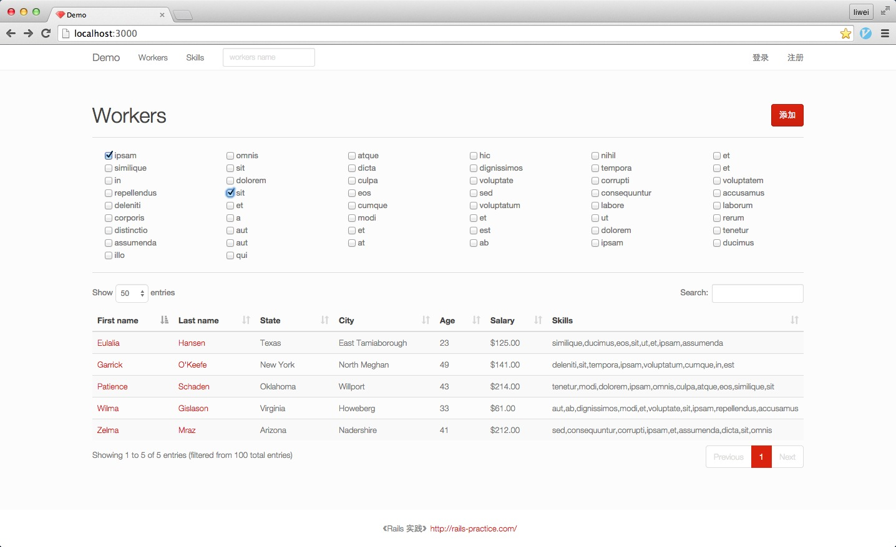

# Subject

Suppose we are building a website which connects workers and customers.

A worker is a registered user, who can choose what she / he can do from a list of skills, such as “cook”, “clean house”, “fix computer”, and so on.

A customer is also a registered user, who can carry out a search to find some workers.

For example, if one customer wants to find a worker who can both clean house and cook, she will open a web page, choose “clean house” and “cook” from a list of skills, then send the request to server. She will get a list of workers, from which she can choose one to work for her.

There could be about 10,000 workers, 10,000 customers and hundreds of skills. There is no limit on how many skills a work or a customer can choose.

Please try to create a prototype of this website with focus on backend, especially models and the search functionality.

# Solution

Rails 4.2.0
datatable(server side process)
bootstrap
bootswatch

# How to run

```
rake db:rebuild
rails s
```

# Screenshot



